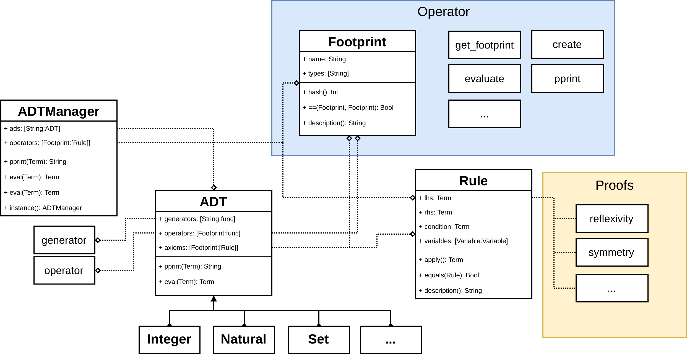

[](https://travis-ci.org/Mandarancio/ProofKit)

# ProofKit
ADT toolkit and Proof verifier based on [LogicKit](https://github.com/kyouko-taiga/LogicKit).

## Implemented ADTs
Currently implemented ADT and Operators

|ADT|Generators|Constructor|Operators|
|---|----------|-----------|---------|
|Boolean|```True() False()```|```n(Bool)```|```not(x) and(x,y) or(x,y)```|
|Nat|```zero() succ(x)```|```n(Int)```|```add(x,y) mul(x,y) pre(x) sub(x,y) div(x,y) mod(x) lt(x,y) gt(x,y) eq(x,y) gcd(x,y) ```|
|Integer|```int(x,y)```|```n(Int)```|```add(x,y) mul(x,y) sub(x,y) div(x,y) abs(x), normalize(x) lt(x,y) gt(x,y) eq(x,y) sign(x) ```|
|[Multiset](https://en.wikipedia.org/wiki/Linked_list)|```empty() cons(first, rest)```|```n([Term])```|```first(x) rest(x) contains(x,y) size(x) concat(x,y) removeOne(x,y) removeAll(x,y) eq(x,y)```|
|[Set](https://en.wikipedia.org/wiki/Set_%28abstract_data_type%29)|```empty() cons(first, rest)```|```n([Term])```|```union(x,y) subSet(x,y) intersection(x,y) difference(x,y)  contains(x,y) size(x) rest(x) first(x) removeOne(x,y) removeAll(x,y) eq(x,y) norm(x) insert(x,y)```|
|Sequence|```empty(), cons(value,index,rest)```|```n([Term])```|```push(value,rest), getAt(sequence, index), setAt(sequence, index, value) size(sequence)```|

## Implemented Proofs:

|Name|Call|Status|
|----|----|------:|
|reflexivity|```Proof.reflexivity(Term) -> Rule```| **tested**|
|symmetry |```Proof.symmetry(Rule) -> Rule``` |**tested** |
|transitivity |```Proof.transitivity(Rule, Rule) -> Rule```| **tested**|
|substitution|```Proof.substitution(Rule, Variable, Term) -> Rule```| **tested**|
|substitutivity|```Proof.substitutivity((Term...)->Term, [Term], [Term]) -> Rule```| **tested**|
|inductive|```Proof.inductive(Rule, Variable, ADT, [String:(Rule...)->Rule])```| - |

## Your first code
Write your first code is simple, your project structure should be something like that:

```
|-- package.swift
|-+ Source
  |-+ Demo
    |-- main.swift
```

The file ```package.swift``` should look like:

```swift
import PackageDescription

let package = Package(
    name: "YOUR_PROJECT_NAME",
    targets: [
   	  Target(name: "YOUR_PROJECT_NAME"), // or whatever is your project name
      ],
    dependencies: [
        .Package(url: "https://github.com/kyouko-taiga/LogicKit",
                 majorVersion: 0),
        .Package(url: "https://github.com/Mandarancio/ProofKit",
                 majorVersion: 0),
    ]
)
```

And finaly your code in ```main.swift```:

```swift
import LogicKit
import ProofKit

let x = Variable(named: "x")
let y = Variable(named: "y")

let goal = (x < Nat.self && y < Nat.self) => ((x + y) <-> Nat.n(10))
for solution in solve(goal).prefix(11)
{
  let rsolution = solution.reified()
  print("x: \(ADTm.pprint(rsolution[x])), y: \(ADTm.pprint(rsolution[y]))")
}
```

Once compiled and executed (*remember*: the binary is located ```.build/debug/YOUR_PROJECT_NAME```) the output should be:

```
x: 0, y: 10
x: 1, y: 9
x: 2, y: 8
x: 3, y: 7
x: 4, y: 6
x: 5, y: 5
x: 6, y: 4
x: 7, y: 3
x: 8, y: 2
x: 9, y: 1
x: 10, y: 0
```

## Advanced usage


### Rule
The *struct* **Rule** is the container of **axioms** and future **theorems**. Is composed in left and right components (both Term) and implement both a function to applay the rule and one to *pretty print* it.
To create a rule simply:

```swift
 1> let r = Rule(
      Nat.add(Variable(named: "x"), Nat.zero()), // left component
      Variable(named: "x"), // right component
      Boolean.True() // optional Boolean condition (default: Boolean.True())
    )
```

Print the rule:

```swift
 2> print(r)
x + 0 = x
```
Apply it:
```swift
 3> let g : Goal = r.applay(Nat.n(4) + Nat.zero(), Variable(named: x)) // create goal (4+0) to applay rule
 4> let res : Term = get_result(g,x) //function solve goal and return the substitution of x
 5> print(ADTm.pprint(res))
4
```

### ADT

All ADTm extend the base *class* **ADT**, this contains both generator, opertors generator and operators axioms as well as some basic helpers such a chek type and a *pretty print* function.

To access to axioms, generators and operators there are always two method a long and a shortcut, e.g. ```get_generator("name")``` and ```g("name")```.

For both **generators** and **operators** is possible to access just using ```["name"]```.

Adding operators and axioms is possible **only internally**.
A simple example is a semplfied version of the boolean adt:
```swift
public class Boolean : ADT {
    public init(){
      super.init("boolean")
      self.add_generator("true", Boolean.True)
      self.add_generator("false", Boolean.False)
      self.add_operator("not", Boolean.not, [
        Rule(Boolean.not(Boolean.False()),Boolean.True()),
        Rule(Boolean.not(Boolean.True()),Boolean.False())
      ], ["boolean"])
    }
    public static func True(_:Term...) -> Term{
      return new_term(Value<Bool>(false), "boolean")
    }

    public static func False(_:Term...) -> Term{
      return new_term(Value<Bool>(false), "boolean")
    }

    public static func not(_ operands: Term...)->Term{
      return Operator.n(Value("nil"), operands[0], "not")
    }
}
```

### ADTManager

Finally to manage the *ADT* and have the possibility to mixit togheter in the future we use an **ADTManager**. This is composed by a dictionary of ADT and some helper function (such as the *pretty printer*).

To avoid the creation of multiple ADTManager, there is a single ADTManager (as the constructor is private) instance called **ADTm**.

To get or add an ADT from the instance **ADTm**:

```swift
let nat : ADT = ADTm["nat"] // to get adt
/// or
ADTm["boolean"] = Boolean() // to add adt
```

To pretty print any term:

```swift
let t = Nat.n(1) + Nat.n(1)
print("\(ADTm.pprit(t))")
//// 1 + 1
print(t)
//// [type: operator, name: "+", 0: [type: nat, value: [succ: [type: nat, value: 0]]]....
```

### How to create an ADT?

You can see an exemple at **Source/ADTDemo**
First create a file with the name of your adt.
You have a typical example at **Source/ADTDemo/char.swift**
Two mains steps when you create your own ADT:
- Create **Generators**
- Create **Operators**

You have to add this in ```public init()``` and create a function
for each **generator** and **operator**.

Moreover you have to override some basics functions for the inheritance if you want that your ADT works!
This functions are:
- **belong** (Goal to know if a term belong to this adt)
- **check** (Simple check to check if a term is of this adt type)
- **pprint** (Print nicely your term)

Nice you have your ADT, but it's not the end! We have seen above the **ADTManager**.
You have to add all of your ADT in this **ADTManager**. You can do it easily as follows:
```swift
// Then you add your new adt to the manager
ADTm["char"] = Char()
```

You have a simple example how ADTManager works at **Source/ADTDemo/main.swift**.
You can make tests with your own ADT that you can add into an ADTManager to use it.
Now you can easily use and test your ADT. Use your ADT to create your variable and use the ADTManager to evaluate operations.

```swift
// Example:

let a = Char.a()
let b = Char.b()
var op = a == b
var r = ADTm.eval(op)
print("\(ADTm.pprint(op)) => \(ADTm.pprint(r))")
// a == b => false
```

#### Universal Evaluator

A simple inner most universal evaluator is implemented. To use it:

```swift
let operation : Term = Nat.n(2) * Nat.n(3)
let result : Term = ADTm.eval(operation)
print(" \(ADTm.pprint(operation)) => \(ADTm.pprint(result))")
//// 2 * 3 => 6
```

To be able to perform any type of computation it trys to solve the inner most operation first using the operation axioms and the generator evaluator.

### Proofs

Now we have all ADT that we need and we can use it for proofs.
Firstly, you have several examples avaible in **Source/EqProofDemo**.
When you want to verify a proof, you need to write all the steps.
For classical proof you just have to follow the example that are avaible.

If you want to create your own induction proof, here are the steps to follow:

1. You just have to specify axioms that you will need.

 ```swift
  let ax0 = ADTm["nat"].a("+")[0]
  let ax1 = ADTm["nat"].a("+")[1]
 ```
2. Write the conjecture you want to verify.

 ```swift
 // We try to proof that succ(0) + x = suc(x)
 let conj = Rule(
   Nat.add(Nat.succ(x: Nat.zero()), Variable(named:"x")),
   Nat.succ(x: Variable(named: "x"))
 )
 ```

3. **For each** generators you have to verify the initial case and
the higher rank. Here we have just one generator!

 ```swift
 // Initial case
 func zero_proof(t: Rule...)->Rule{
   let ax0 = ADTm["nat"].a("+")[0]
   // s(0)+0 = s(0)
   return Proof.substitution(ax0, Variable(named: "x"), Nat.succ(x: Nat.zero()))
 }
```
```swift
// Higher rank
 func succ_proof(t: Rule...)->Rule{
   let ax1 = ADTm["nat"].a("+")[1]
   // s(0) + s(y) = s(s(0) + y)
   let t2 = Proof.substitution(ax1, Variable(named: "x"), Nat.succ(x: Nat.zero()))
   // s(s(0) + x) = s(s(x))
   let t3 = Proof.substitutivity (Nat.succ, [t[0]])
   // s(0) + s(y) = s(s(y))
   return Proof.transitivity(t2, t3)
 }
 ```

4. Now we can call out our function to know if steps are good.

 ```swift
 do {
   let teo = try Proof.inductive(conj, Variable(named: "x"), ADTm["nat"], [
     "zero": zero_proof,
     "succ": succ_proof
   ])
   print("Indcutive result: \(teo)")
 }
 // If the induction failed
 catch ProofError.InductionFail {
   print("Induction failed!")
 }
 ```

 Great! Now you can see "true" if all are good!

## Syntattic Sugar

LogicKit integration:

|Syntax| Semantic|
|---|---|
|```Term ∈ ADT.Type: Goal```|  Term in ADT|
|```Term < ADT.Type: Goal```|  Term in ADT|
|```Goal => Goal: Goal```| Goal such that Goal |
|```Term <-> Term: Goal```| evalue(Term) equal to evalue(Term) |

Mathematical operations:

|Operation| Symbol| Supported types|
|---------|:-----:|----------------|
|sum      |+      |Nat, Integer    |
|diffrence|-      |Nat, Integer    |
|multiply |*      |Nat, Integer    |
|divide   |/      |Nat, Integer    |
|equal    |==     |All types       |
|great    |>      |Nat, Integer    |
|less     |<      |Nat, Integer    |
|and      |&amp;&amp;|Boolean      |
|or       |&#124;&#124;|Boolean         |

Using LogicKit and the ```ADTm.geval()``` method is possible to evaluate simple logic expressions:

```swift
let x = Variable(named: "x")
let y = Variable(named: "y")

// x,y ∈ Nat => (x+y) < 9 && x<y
let goal = x ∈ Nat.self &&  y ∈ Nat.self => (x+y) <-> Nat.n(6) && (x<y) <-> Boolean.True()
// NOTE < can be used instead of ∈

for sol in solve(goal).prefix(3){ // NOTE .prefix(N) is used to stop the research of possible solution after N found
  let rsol = sol.reified()
  print(" x: \(ADTm.pprint(rsol[x]), y: \(ADTm.pprint(rsol[y]))")
}

```

Resulting in:

```
 x: 0, y: 6
 x: 1, y: 5
 x: 2, y: 4
```


<!-- ## Example

A simple example using only the ADTManager and applaying one axiom:

```swift
let o = ADTm["nat"]["+"](Nat.n(2), Nat.n(1))
print(" axiom 1: \(ADTm["nat"].a("+")[1].pprint())")
let g : Goal = ADTm["nat"].a("+")[1].applay(o,x) //applay axiom 1
let res : Term = get_result(g,x) //function solve goal and return the substitution of x
print(" \(ADTm.pprint(o)) => \(ADTm.pprint(res))")
```

results in:
```
axiom 1: $1 + succ($2) = succ($1 + $2)
2 + 1 => succ(2 + 0)
``` -->
